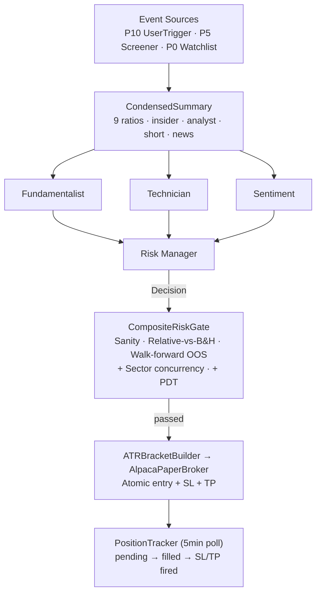

# QuanterBack

LLM-driven Alpaca paper trading harness. Four specialized agents (Fundamentalist · Technician · Sentiment · Risk Manager) debate every trade. Bracket orders with walk-forward validated risk gates. Telegram operations.

Paper trading only. Not for real capital.

## Architecture



Hexagonal: `pipeline.py` depends on Protocols only. Adapters under `src/quanterback/adapters/`.

## Quick start

```bash
git clone https://github.com/Kiyo5hi/quanterback
cd quanterback
cp config/quanterback.local.toml.example config/quanterback.local.toml
# fill in Alpaca + LLM + Telegram credentials
make build && make up
docker compose exec scan quanterback scan --tickers AAPL,NVDA --format brief
```

Local development without Docker:

```bash
pip install -e ".[dev]"
pytest
quanterback scan --tickers AAPL
```

## Example /scan output

```
📋 Scan Brief — 2026-05-24 03:11 UTC · Trigger: /scan AMD

═══ 🟢 BUY (1) ═══
AMD — MOMENTUM  conf 0.70  size $2,556 (3 sh @ $852)
  Signals: trend uptrend  RSI 72  MACD bearish_cross  vol high
  Insider 30d: 0 buys / 0 sells  ·  Analyst 14d: 0 up / 0 down
  Short: 2.2% float  ·  EPS Q YoY +95%  ·  Earnings: 72d away
  Risk: SL $818 (-4.0%) / TP $920 (+8.0%)  R/R 1:2.0
  > RM: 2-of-3 bullish (technicals + sentiment), 72d to earnings, market context favorable.

  Agent debate:
    🔵 Fundamentalist (neutral 0.70): Most core metrics missing; EPS YoY +95% is the only bullish signal.
    📊 Technician (bullish 0.65): SMA20/50/200 bullish stack, 20d outperformance vs SPY ~30%, 52w high.
    💬 Sentiment (bullish 0.80): 3 positive AMD news items in 24h.
```

## CLI

| Command | Purpose |
|---|---|
| `scan --tickers X,Y` | Scan specific tickers |
| `rescan` | Full watchlist re-scan |
| `control-bot` | Start Telegram bot |
| `positions` | List open positions |
| `trades --last N` | Recent closed trades |
| `perf` | P&L analysis |
| `analyze` | Decision pattern analysis |
| `calibration` | Confidence vs outcome |
| `replay --start DATE --end DATE` | Historical replay |
| `stress` | Cross-regime test |
| `watchlist {list,add,remove}` | Manage watchlist |

## Telegram

```
/scan AAPL              Synchronous scan with full 4-agent debate
/rescan                 Full watchlist re-scan
/watchlist /add /remove Watchlist management
/status                 System state
/freeze /unfreeze       Pause / resume new entries
/halt /unhalt           Hard stop / resume
```

Responses thread under the user's command. Long output chunked across messages.

## Configuration

`config/quanterback.toml` (committed) — defaults. `config/quanterback.local.toml` (gitignored) — secrets + overrides.

```toml
[market]
benchmark_ticker = "VOO"

[position]
position_size_pct = 0.05
max_concurrent_positions = 5

[risk.sl_tp]
sl_atr_multiple = 1.5
tp_atr_multiple = 3.0

[llm]
provider = "claude"
strategist_mode = "multi_agent"
agent_parallel = true
```

See `config/quanterback.local.toml.example`.

## Testing

```bash
make test        # pytest
make typecheck   # mypy strict
make lint        # ruff
```

## License

MIT. See [LICENSE](LICENSE).

## Disclaimer

For educational and research purposes only. Not financial advice. Trading involves risk of loss.
